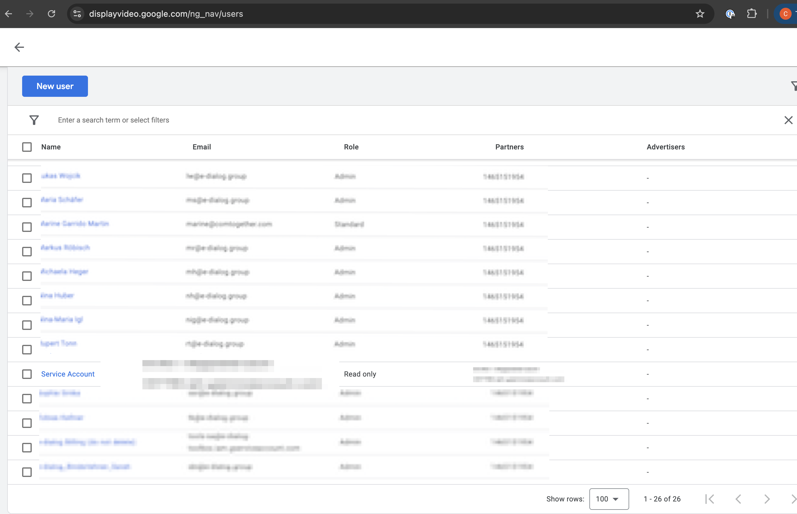
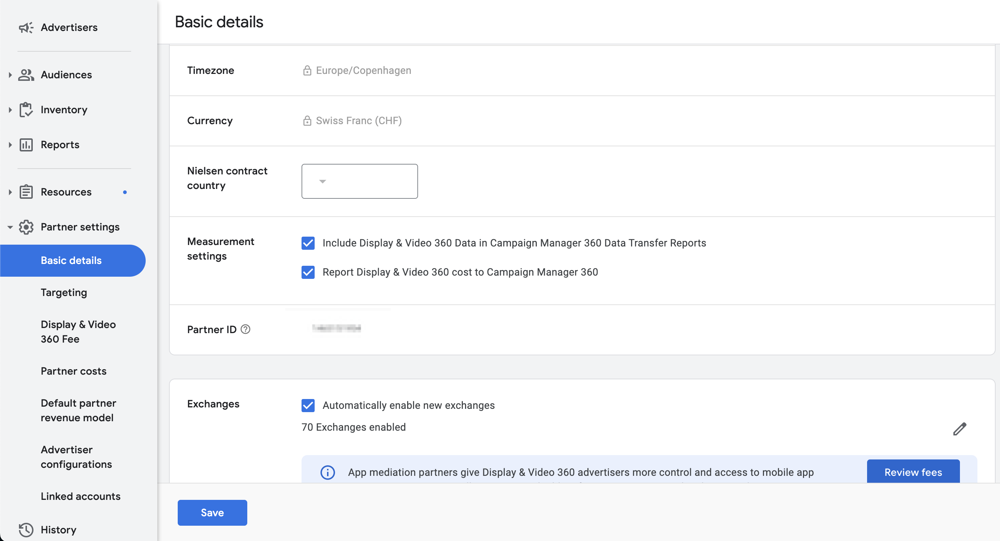

# DV360 MCP Server

A Model Context Protocol (MCP) server for Display & Video 360 (DV360) that provides entity management and performance reporting capabilities.

## Architecture

This server integrates with two Google APIs to provide comprehensive DV360 access:

- **Display & Video 360 API (v4)**: Entity management (campaigns, insertion orders, creatives)
- **Bid Manager API (v2)**: Performance reporting (impressions, clicks, conversions, costs)

## Features

- **Entity Management**: List and retrieve campaigns, insertion orders, and creatives with filtering and ordering
- **Performance Reporting**: Run synchronous reports with comprehensive metrics
- **Advanced Filtering**: Filter entities by status, dates, and other properties
- **Custom Ordering**: Sort results by any field in ascending or descending order
- **Flexible Input Types**: Accepts dimensions/metrics as lists or comma-separated strings
- **Comprehensive Metrics**: Access all DV360 metrics and dimensions

## Prerequisites

### 1. Google Cloud Project Setup

1. Create or select a project in [Google Cloud Console](https://console.cloud.google.com/)
2. Enable the required APIs:
   - **Display & Video 360 API** (for entity management)
   - **DoubleClick Bid Manager API** (for reporting)
3. Create a service account:
   - Go to IAM & Admin > Service Accounts
   - Create a new service account
   - Download the JSON key file

### 2. DV360 Platform Setup

Your service account needs to be granted access in the DV360 platform:

1. Log into [Display & Video 360](https://displayvideo.google.com/)
2. Navigate to **Settings** > **Access Management**
3. Click **Add User**
4. Enter the service account email (found in your JSON key file: `client_email`)
5. Assign appropriate permissions:
   - **Read & Write** access for entity management tools
   - **Read** access is sufficient if you only need reporting
6. Select the partner(s) and advertiser(s) the service account should access



**Note**: The service account email looks like: `your-service-account@your-project.iam.gserviceaccount.com`

### 3. Find Your Partner ID (Optional)

If you want to use `list_advertisers` without specifying a partner ID each time:

**Method 1: From any DV360 URL**
1. Log into DV360
2. Look at the URL: `https://displayvideo.google.com/ng_nav/p/[PARTNER_ID]/...`
3. The number after `/p/` is your Partner ID

**Method 2: From Partner Settings**
1. Log into DV360
2. Navigate to **Partner Settings** > **Basic Details**
3. The URL will be: `https://displayvideo.google.com/ng_nav/p/{partner-id}/details`
4. Your Partner ID is visible in the URL
5. Or Locate using the below image as reference



Once you have your Partner ID, add it to your `.env` file:
```bash
DV360_PARTNER_ID=your_partner_id
```

## Installation

1. **Clone the repository:**
```bash
git clone <repository-url>
cd dv360-ads-mcp-server
```

2. **Install dependencies:**
```bash
pip install -r requirements.txt
```

3. **Configure environment variables:**
```bash
cp .env.example .env
```

Edit `.env` and set:
```bash
# Paste the entire service account JSON as a string
DV360_SERVICE_ACCOUNT={"type":"service_account","project_id":"your-project",...}
DV360_PARTNER_ID=your_partner_id  # Optional
```

**Note**: The service account JSON should be the entire contents of your downloaded service account key file, formatted as a single-line string.

**Formatting options** (both work with dotenv):
- Without quotes: `DV360_SERVICE_ACCOUNT={"type":"service_account",...}`
- With single quotes: `DV360_SERVICE_ACCOUNT='{"type":"service_account",...}'`
- With double quotes: `DV360_SERVICE_ACCOUNT="{"type":"service_account",...}"`

If one format doesn't work in your environment, try another. The dotenv library handles these variations automatically.

## Configuration for Claude Desktop

Add this to your Claude Desktop config file:

**macOS**: `~/Library/Application Support/Claude/claude_desktop_config.json`
**Windows**: `%APPDATA%\Claude\claude_desktop_config.json`

```json
{
  "mcpServers": {
    "dv360": {
      "command": "python",
      "args": ["/full/path/to/dv360-ads-mcp-server/server.py"]
    }
  }
}
```

## Available Tools

### Entity Management Tools

#### Campaigns

**list_campaigns** - List all campaigns for an advertiser
```python
list_campaigns(
    advertiser_id="123456",
    filter='entityStatus="ENTITY_STATUS_ACTIVE"',
    order_by="displayName",
    page_size=100
)
```

**get_campaign** - Get detailed information about a specific campaign
```python
get_campaign(
    advertiser_id="123456",
    campaign_id="789012"
)
```

#### Insertion Orders

**list_insertion_orders** - List all insertion orders for an advertiser
```python
list_insertion_orders(
    advertiser_id="123456",
    filter='entityStatus="ENTITY_STATUS_ACTIVE"',
    order_by="displayName",
    page_size=100
)
```

**get_insertion_order** - Get detailed information about a specific insertion order
```python
get_insertion_order(
    advertiser_id="123456",
    insertion_order_id="789012"
)
```

#### Creatives

**list_creatives** - List all creatives for an advertiser
```python
list_creatives(
    advertiser_id="123456",
    filter='entityStatus="ENTITY_STATUS_ACTIVE"',
    order_by="displayName",
    page_size=100
)
```

**get_creative** - Get detailed information about a specific creative
```python
get_creative(
    advertiser_id="123456",
    creative_id="789012"
)
```

#### Advertisers

**list_advertisers** - List all advertisers under a partner
```python
list_advertisers(
    partner_id="123456",  # Optional if DV360_PARTNER_ID is set
    order_by="displayName",
    page_size=100
)
```

### Filtering Examples

All list tools support filtering by various criteria:

**Entity Status:**
- `entityStatus="ENTITY_STATUS_ACTIVE"`
- `entityStatus="ENTITY_STATUS_PAUSED"`
- `entityStatus="ENTITY_STATUS_ARCHIVED"`

**Date Ranges:**
- `updateTime>"2025-01-01T00:00:00Z"`
- `updateTime<"2025-12-31T23:59:59Z"`

**Ordering:**
- `displayName` (ascending)
- `displayName desc` (descending)
- `updateTime desc`

### Reporting Tools

## Usage

### Running a Report

The main tool is `run_report`, which creates a query, runs it synchronously, downloads the CSV, and returns JSON data:

```python
run_report(
    start_date="2025-01-01",
    end_date="2025-01-31",
    dimensions=["FILTER_DATE", "FILTER_ADVERTISER_NAME", "FILTER_MEDIA_PLAN_NAME"],
    metrics=["METRIC_IMPRESSIONS", "METRIC_CLICKS", "METRIC_CTR", "METRIC_TOTAL_CONVERSIONS"],
    advertiser_ids="123456789"
)
```

### Available Parameters

- **start_date** (required): Start date in YYYY-MM-DD format
- **end_date** (required): End date in YYYY-MM-DD format
- **dimensions** (required): Dimensions to group by (list or comma-separated string)
- **metrics** (required): Metrics to retrieve (list or comma-separated string)
- **advertiser_ids** (optional): Filter by advertiser ID(s)
- **campaign_ids** (optional): Filter by campaign ID(s)
- **insertion_order_ids** (optional): Filter by insertion order ID(s)
- **line_item_ids** (optional): Filter by line item ID(s)
- **report_name** (optional): Name for the report (default: "MCP Report")

### Flexible Input Types

You can provide dimensions and metrics in multiple ways:

```python
# As a list
dimensions=["FILTER_DATE", "FILTER_ADVERTISER_NAME"]

# As a comma-separated string
dimensions="FILTER_DATE, FILTER_ADVERTISER_NAME"

# Same for IDs
advertiser_ids=["123", "456"]  # or
advertiser_ids="123, 456"
```

## Available Dimensions

### Entity Dimensions
- `FILTER_ADVERTISER`: Advertiser ID
- `FILTER_ADVERTISER_NAME`: Advertiser name
- `FILTER_MEDIA_PLAN`: Campaign ID
- `FILTER_MEDIA_PLAN_NAME`: Campaign name
- `FILTER_INSERTION_ORDER`: Insertion Order ID
- `FILTER_INSERTION_ORDER_NAME`: Insertion Order name
- `FILTER_LINE_ITEM`: Line Item ID
- `FILTER_LINE_ITEM_NAME`: Line Item name
- `FILTER_CREATIVE`: Creative ID
- `FILTER_CREATIVE_TYPE`: Creative type

### Time Dimensions
- `FILTER_DATE`: Date
- `FILTER_WEEK`: Week
- `FILTER_MONTH`: Month
- `FILTER_YEAR`: Year

### Geographic Dimensions
- `FILTER_COUNTRY`: Country
- `FILTER_REGION`: Region/State
- `FILTER_CITY`: City
- `FILTER_DMA`: Designated Market Area

### Device Dimensions
- `FILTER_DEVICE_TYPE`: Device type
- `FILTER_BROWSER`: Browser
- `FILTER_OS`: Operating system
- `FILTER_ENVIRONMENT`: Environment (App/Web)

## Available Metrics

### Impression Metrics
- `METRIC_IMPRESSIONS`: Total impressions
- `METRIC_VIEWABLE_IMPRESSIONS`: Viewable impressions
- `METRIC_MEASURABLE_IMPRESSIONS`: Measurable impressions

### Click Metrics
- `METRIC_CLICKS`: Total clicks
- `METRIC_CTR`: Click-through rate

### Conversion Metrics
- `METRIC_TOTAL_CONVERSIONS`: Total conversions
- `METRIC_LAST_CLICKS`: Last-click conversions
- `METRIC_LAST_IMPRESSIONS`: Last-impression conversions

### Cost Metrics
- `METRIC_MEDIA_COST_ADVERTISER`: Media cost
- `METRIC_BILLABLE_COST_ADVERTISER`: Billable cost
- `METRIC_TOTAL_MEDIA_COST_ADVERTISER`: Total media cost

### Revenue Metrics
- `METRIC_REVENUE_ADVERTISER`: Revenue
- `METRIC_PROFIT_ADVERTISER`: Profit
- `METRIC_ROI_RATIO`: ROI ratio

### Video Metrics
- `METRIC_VIDEO_COMPLETION_RATE`: Video completion rate
- `METRIC_TRUEVIEW_VIEWS`: TrueView views
- `METRIC_VIDEO_QUARTILE_25_RATE`: 25% completion
- `METRIC_VIDEO_QUARTILE_50_RATE`: 50% completion
- `METRIC_VIDEO_QUARTILE_75_RATE`: 75% completion
- `METRIC_VIDEO_QUARTILE_100_RATE`: 100% completion

For the complete list, see: https://developers.google.com/bid-manager/reference/rest/v2/filters-metrics

## Using Tools Together for Performance Analysis

The entity management tools work seamlessly with the reporting tools to enable comprehensive performance analysis:

### Example Workflow: Campaign Performance Analysis

1. **List active campaigns**
```python
campaigns = list_campaigns(
    advertiser_id="123456",
    filter='entityStatus="ENTITY_STATUS_ACTIVE"'
)
```

2. **Get detailed campaign information**
```python
campaign = get_campaign(
    advertiser_id="123456",
    campaign_id=campaigns['campaigns'][0]['campaign_id']
)
```

3. **Run performance report for specific campaigns**
```python
report = run_report(
    start_date="2025-01-01",
    end_date="2025-01-31",
    dimensions=["FILTER_DATE", "FILTER_MEDIA_PLAN_NAME", "FILTER_INSERTION_ORDER_NAME"],
    metrics=["METRIC_IMPRESSIONS", "METRIC_CLICKS", "METRIC_CTR", "METRIC_TOTAL_CONVERSIONS"],
    campaign_ids=campaigns['campaigns'][0]['campaign_id']
)
```

### Example Workflow: Creative Performance by Campaign

1. **List all creatives for an advertiser**
```python
creatives = list_creatives(
    advertiser_id="123456",
    filter='entityStatus="ENTITY_STATUS_ACTIVE"'
)
```

2. **Run creative performance report**
```python
report = run_report(
    start_date="2025-01-01",
    end_date="2025-01-31",
    dimensions=["FILTER_CREATIVE", "FILTER_CREATIVE_TYPE", "FILTER_MEDIA_PLAN_NAME"],
    metrics=["METRIC_IMPRESSIONS", "METRIC_CLICKS", "METRIC_VIDEO_COMPLETION_RATE"],
    advertiser_ids="123456"
)
```

### Example Workflow: Insertion Order Budget Analysis

1. **List insertion orders with budget data**
```python
ios = list_insertion_orders(
    advertiser_id="123456",
    filter='entityStatus="ENTITY_STATUS_ACTIVE"',
    order_by="displayName"
)

# Each IO includes budget information:
for io in ios['insertion_orders']:
    print(f"{io['insertion_order_name']}: {io['budget']}")
```

2. **Get detailed insertion order info**
```python
io_detail = get_insertion_order(
    advertiser_id="123456",
    insertion_order_id=ios['insertion_orders'][0]['insertion_order_id']
)
```

3. **Run performance report for specific insertion orders**
```python
report = run_report(
    start_date="2025-01-01",
    end_date="2025-01-31",
    dimensions=["FILTER_DATE", "FILTER_INSERTION_ORDER_NAME"],
    metrics=["METRIC_IMPRESSIONS", "METRIC_MEDIA_COST_ADVERTISER", "METRIC_TOTAL_CONVERSIONS"],
    insertion_order_ids=[io['insertion_order_id'] for io in ios['insertion_orders'][:5]]
)
```

## Example Queries

### Daily Campaign Performance
```python
run_report(
    start_date="2025-01-01",
    end_date="2025-01-31",
    dimensions=["FILTER_DATE", "FILTER_MEDIA_PLAN_NAME"],
    metrics=["METRIC_IMPRESSIONS", "METRIC_CLICKS", "METRIC_CTR", "METRIC_TOTAL_CONVERSIONS", "METRIC_MEDIA_COST_ADVERTISER"],
    advertiser_ids="123456789"
)
```

### Creative Performance by Device
```python
run_report(
    start_date="2025-01-01",
    end_date="2025-01-31",
    dimensions=["FILTER_CREATIVE_TYPE", "FILTER_DEVICE_TYPE"],
    metrics=["METRIC_IMPRESSIONS", "METRIC_CLICKS", "METRIC_VIEWABLE_IMPRESSIONS"],
    advertiser_ids="123456789"
)
```

### Geographic Performance
```python
run_report(
    start_date="2025-01-01",
    end_date="2025-01-31",
    dimensions=["FILTER_COUNTRY", "FILTER_REGION"],
    metrics=["METRIC_IMPRESSIONS", "METRIC_CLICKS", "METRIC_TOTAL_CONVERSIONS", "METRIC_REVENUE_ADVERTISER"],
    advertiser_ids="123456789"
)
```

## Response Format

The server returns a JSON response with the following structure:

```json
{
  "success": true,
  "data": [
    {
      "Date": "2025-01-01",
      "Advertiser": "My Advertiser",
      "Campaign": "My Campaign",
      "Impressions": 10000,
      "Clicks": 150,
      "CTR": 1.5,
      "Total Conversions": 10
    }
  ],
  "metadata": {
    "query_id": "12345",
    "report_id": "67890",
    "date_range": {
      "start_date": "2025-01-01",
      "end_date": "2025-01-31"
    },
    "dimensions": ["FILTER_DATE", "FILTER_ADVERTISER_NAME", "FILTER_MEDIA_PLAN_NAME"],
    "metrics": ["METRIC_IMPRESSIONS", "METRIC_CLICKS", "METRIC_CTR", "METRIC_TOTAL_CONVERSIONS"],
    "row_count": 31
  }
}
```

## Troubleshooting

### Service Account Errors
- Ensure your service account has access to your DV360 account
- Verify the service account JSON is correctly formatted in the DV360_SERVICE_ACCOUNT environment variable
- Check that the service account has the Display & Video 360 API enabled
- Make sure the JSON string is properly escaped and quoted in your .env file

### Query Errors
- Some dimension/metric combinations are not compatible
- Test your query in the DV360 UI first to ensure it works
- Check the [official documentation](https://developers.google.com/bid-manager/reference/rest/v2/filters-metrics) for valid combinations

### Rate Limits
- Google enforces rate limits on the Bid Manager API
- If you hit rate limits, reduce query frequency or batch your requests

## Resources

- [DV360 Bid Manager API Documentation](https://developers.google.com/bid-manager)
- [Filters and Metrics Reference](https://developers.google.com/bid-manager/reference/rest/v2/filters-metrics)
- [FastMCP Documentation](https://github.com/anthropics/fastmcp)

## Comparison with Original Implementation

### Original (ReportCreatorDV360.py)
- ❌ Asynchronous with polling loop
- ❌ Manual CSV download and formatting
- ❌ Files left on disk requiring cleanup
- ❌ Complex retry logic needed

### New MCP Server
- ✅ Synchronous execution (waits automatically)
- ✅ Automatic CSV parsing to JSON
- ✅ No files on disk
- ✅ Simple, clean interface

## License

MIT
